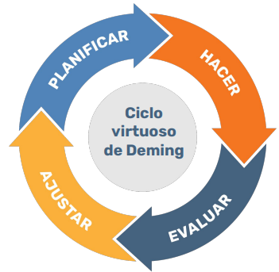
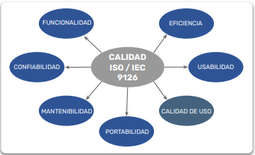
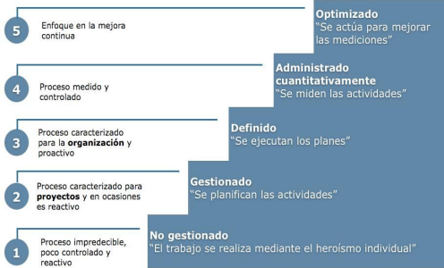
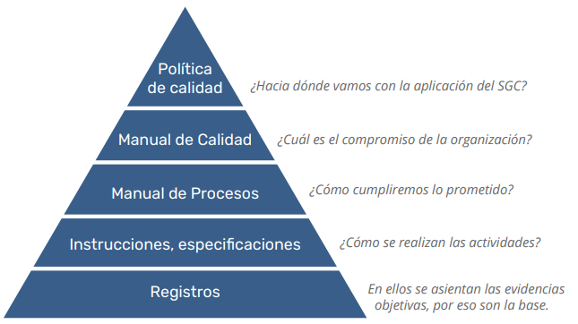
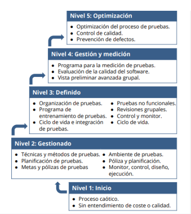

# Conceptos de Calidad

## Contenido

- [**¿Qué es calidad?**](#qué-es-calidad)
- [**¿Cómo hacemos calidad?**](#cómo-hacemos-calidad)
- [**¿Dónde aplica?**](#dónde-aplica)
- [**QA vs QC**](#qa-vs-qc)
- [**Atributos de Calidad**](#atributos-de-calidad)
- [**Ciclo Virtuoso de Deming**](#ciclo-virtuoso-de-deming)
- [**Normas y Estándares**](#normas-y-estándares)
- [**Modelos de Madurez**](#modelos-de-madurez)

---

## ¿Qué es calidad?

La **calidad** es el grado en que un sistema, componente o proceso cumple con los requisitos especificados y satisface las expectativas o necesidades del cliente. Implica entregar productos o servicios que sean confiables, funcionales y que generen valor para el usuario final.

---

## ¿Cómo hacemos calidad?

1. **Validar el propósito del producto:**  
   Comprender el objetivo y la utilidad del producto, alineando los requerimientos con las necesidades del usuario o cliente.

2. **Identificar los atributos clave:**  
   Determinar y describir las funcionalidades esenciales para la viabilidad y éxito del producto.

3. **Cuantificar los atributos:**  
   Asignar métricas y valores medibles a cada funcionalidad.

4. **Definir patrones de medición:**  
   Establecer criterios y métricas para evaluar el cumplimiento de cada atributo.

5. **Medir el producto o una muestra:**  
   Realizar pruebas y registrar los resultados por atributo y funcionalidad.

6. **Comparar resultados contra métricas:**  
   Contrastar los resultados obtenidos con los criterios de aceptación definidos.

7. **Aprobar o documentar desviaciones:**  
   Documentar los resultados, calcular promedios y verificar el cumplimiento de los criterios de aceptación.

---

## ¿Dónde aplica?

- En **procesos** y **productos**.
- Debe estar **orientada al cliente**.
- Es una **mejora continua**.
- Debe ser **medible** y **objetiva**.
- Involucra a **toda la organización**.
- Incorpora **activos** y valor a la compañía.

---

## QA vs QC

### Quality Assurance (QA) - Aseguramiento de la Calidad

- Se enfoca en los **procesos**.
- Garantiza que los desarrollos cumplan con los **procesos y estándares definidos**.
- Busca la **prevención** de defectos mediante la mejora continua de los procesos.
- Revisa y mejora los **procedimientos** y **metodologías**.

### Quality Control (QC) - Control de Calidad

- Se enfoca en los **productos**.
- Verifica que los productos cumplan con los **estándares de calidad** especificados.
- Busca la **detección** de defectos mediante inspección y pruebas.
- Revisa los **resultados** y **entregables**.

---

## Atributos de Calidad

### QC (Control de Calidad)

- **Usabilidad:** El producto debe ser fácil de usar y accesible en todas sus funcionalidades.
- **Corrección:** El producto debe satisfacer las necesidades y requerimientos del cliente.
- **Confiabilidad:** La información entregada debe ser precisa y consistente.
- **Disponibilidad:** El sistema y sus datos deben estar accesibles para los usuarios autorizados.
- **Performance:** El producto debe cumplir con los tiempos de respuesta y rendimiento establecidos.
- **Mantenibilidad:** Debe ser fácil y económico de actualizar, configurar y corregir.

### QA (Aseguramiento de la Calidad)

- **Definido:** Procesos claros, completos y documentados en todas sus etapas.
- **Documentado:** Procesos escritos e incorporados en los procedimientos organizacionales.
- **Practicado:** Procesos aplicables y comprensibles para todos los involucrados.
- **Medido:** Control y seguimiento a través de indicadores y resultados obtenidos.

### Otros atributos relevantes

- **Seguridad:** Protección de datos y prevención de accesos no autorizados.
- **Portabilidad:** Capacidad del producto para adaptarse y funcionar en diferentes entornos.
- **Escalabilidad:** Facilidad para crecer y adaptarse a mayores demandas.

---

## Ciclo Virtuoso de Deming

Espiral ascendente de **mejora continua de la calidad**.

- **Planificar (Plan):** Analizar y planificar todas las actividades necesarias para cumplir el propósito.
- **Hacer (Do):** Ejecutar las acciones conforme al plan establecido.
- **Verificar (Check):** Medir y controlar lo realizado frente a lo especificado en el plan.
- **Actuar (Act):** Adaptar y mejorar los procesos según los resultados obtenidos.

Cada ciclo impulsa la evolución del producto:

- Si algo está mal, se corrige.
- Si está correcto, se mejora.
- Si está mejorado, se busca la excelencia.
- Si es excelente, se aspira a ser 'world class'.
- Si es 'world class', se cambia el paradigma.

**La mejora continua es el objetivo permanente.**

---

## Normas y Estándares

**ISO 9126** fue un estándar internacional para la evaluación de la calidad del software. Sus principales atributos son:

- **Funcionalidad:** Capacidad del software para satisfacer necesidades explícitas e implícitas mediante funciones específicas.
- **Fiabilidad:** Capacidad de mantener el nivel de prestación bajo condiciones establecidas durante un periodo determinado.
- **Usabilidad:** Facilidad de uso y aprendizaje para el usuario.
- **Eficiencia:** Relación entre el desempeño del software y los recursos utilizados.
- **Mantenibilidad:** Facilidad para modificar, corregir o mejorar el sistema.
- **Portabilidad:** Capacidad para ser transferido y adaptado a diferentes plataformas.
- **Calidad en uso:** Grado de satisfacción y seguridad percibida por el usuario final.

---

## Modelos de Madurez

### CMMI (Capability Maturity Model Integration)

El **CMMI** es un modelo de madurez de capacidades integrado, desarrollado por el SEI (_Software Engineering Institute_). Evalúa la madurez de los procesos de desarrollo de software en una escala del 1 al 5 e integra disciplinas como sistemas y software en un solo marco de trabajo.

> ### 🗂️ Niveles de CMMI
>
> **5. Optimizado:** Se actúa para mejorar las mediciones.
> **4. Administrado cuantitativamente:** Se miden las actividades.
> **3. Definido:** Se ejecutan los planes.
> **2. Gestionado:** Se planifican las actividades.
> **1. Inicial:** El trabajo depende del esfuerzo individual.

---

### Estructura de Implementación

- **Estándar**
  ⬇️
- **Metodología**
  ⬇️
- **Aplicación / Plantillas**

Basado en un **Sistema de Gestión de Calidad (SGC)**.

---

### TMMi (Test Maturity Model integrated)

**TMMi** es el estándar internacional promovido por la TMMi Foundation, que mide y mejora los procesos y actividades relacionados con el diseño y ejecución de servicios de Testing y Calidad del software. Ayuda a las empresas a implementar prácticas adecuadas para la detección y prevención temprana de defectos.

- Define áreas de proceso y objetivos basados en casos prácticos.
- Utiliza niveles de madurez para la evaluación y mejora del proceso (cinco niveles).
- Establece objetivos y prácticas específicas y genéricas.

---

### ISO (Organización Internacional de Normalización)

La **ISO** es una organización internacional fundada en 1947, dedicada a la creación de estándares globales. Promueve el uso de normas industriales y comerciales en todo el mundo, como la **ISO 9126** (calidad de software) y otras relacionadas con la gestión de calidad.

---

### [⬅️ Volver al índice del módulo](../modulo1_principios_fundamentos.md) | [🏠 Menú principal](../README.md)
