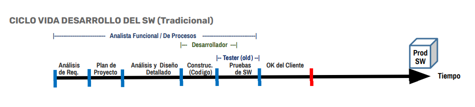
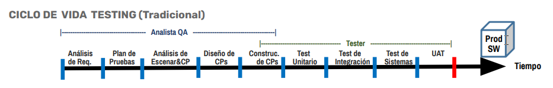

# Conceptos Fundamentales de Testing

En este apartado se presentan los conceptos esenciales relacionados con el testing de software, abarcando tipos de pruebas, ciclo de vida, roles, buenas prácticas y herramientas más utilizadas en la industria.

## Índice

- [¿Qué es el testing?](#qué-es-el-testing)
- [Visión del testing](#visión-del-testing)
- [¿Por qué testeamos?](#por-qué-testeamos)
- [Actividades del analista QA/Tester](#actividades-del-analista-qatester)
- [Validación vs. Verificación](#validación-vs-verificación)
- [Error, falla y defecto](#error-falla-y-defecto)
- [Trazabilidad](#trazabilidad)
- [Ciclo de vida del testing](#ciclo-de-vida-del-testing)

---

## ¿Qué es el testing?

El **testing** es el proceso que abarca todas las actividades del ciclo de vida del software, tanto estáticas como dinámicas, relacionadas con la **planificación**, **preparación** y **evaluación** de productos de software y sus artefactos. Su objetivo principal es verificar que el producto cumpla con los requisitos especificados, demostrar que es **apto para su propósito** y detectar defectos para mejorar la calidad.

> "El testing no solo busca encontrar errores, sino también prevenirlos y asegurar la satisfacción del usuario final."

---

## Visión del testing

### Perspectiva histórica

- **Tradicional:** El testing era visto únicamente como la ejecución de aplicaciones para encontrar defectos.

### Perspectiva actual

- **Moderna:** El testing es un proceso inmerso en la mejora continua de la calidad, involucrando prevención, análisis y colaboración entre equipos.

---

## ¿Por qué testeamos?

### Propósitos principales

- Detectar y resolver problemas lo antes posible.
- Verificar que el software cumple con los requisitos y expectativas.
- Generar confianza y compromiso en los usuarios.
- Promover la cultura de "cero defectos" desde el inicio del proyecto.
- Mejorar la calidad y reducir costos de corrección en etapas posteriores.

---

## Actividades del analista QA/Tester

1. Definir estrategias y planes de prueba.
2. Analizar requisitos y especificaciones.
3. Diseñar casos de prueba efectivos y completos.
4. Configurar ambientes de prueba adecuados.
5. Generar y gestionar datos de prueba.
6. Ejecutar casos de prueba manuales y/o automatizados.
7. Administrar, registrar y reportar resultados de pruebas.
8. Realizar reportes y seguimiento de defectos.
9. Elaborar informes de avance y cierre de pruebas.
10. Monitorear indicadores de gestión de calidad.
11. Asistir a usuarios en pruebas de aceptación (UAT).
12. Colaborar con equipos de desarrollo y negocio.

---

## Validación vs. Verificación

La diferencia clave entre validación y verificación radica en el enfoque y el momento en que se aplican:

- **Validación:** ¿Estamos construyendo el producto correcto? Se asegura de que el software cumpla con las necesidades y expectativas del cliente.
- **Verificación:** ¿Estamos construyendo correctamente el producto? Se enfoca en comprobar que el software cumple con las especificaciones técnicas y funcionales.

> **Validación:** "¿Es esta la especificación correcta?"
> **Verificación:** "¿Es el sistema correcto para la especificación?"

---

## Error, falla y defecto

- **Error:** Equivocación humana, como un malentendido, omisión o acción incorrecta durante el desarrollo o mantenimiento del software.
- **Defecto:** Imperfección en un componente o sistema que puede provocar un fallo. Los defectos son el resultado de errores humanos.
- **Falla:** Manifestación de un defecto, es decir, la diferencia entre el resultado esperado y el obtenido durante la ejecución del software.

> Un error puede generar un defecto, y un defecto puede provocar una falla en el sistema.

---

## Trazabilidad

La **trazabilidad** es la capacidad de identificar y vincular elementos relacionados en la documentación y el software, como requisitos, casos de prueba, incidencias y entregables. Permite asegurar que cada requisito está cubierto por pruebas y facilita el seguimiento de cambios y el análisis de impacto.

**Beneficios:**

- Mejora la gestión de requisitos y pruebas.
- Facilita la detección de brechas y redundancias.
- Permite el análisis de impacto ante cambios.

---

## Ciclo de vida del testing

El ciclo de vida del testing describe las etapas y actividades que se llevan a cabo para garantizar la calidad del software. Existen diferentes enfoques según el modelo de desarrollo:

### Ciclo de vida del testing (Tradicional)

**Etapas principales:**

1. Análisis de requisitos
2. Planificación de pruebas
3. Diseño de casos de prueba
4. Preparación de ambientes y datos
5. Ejecución de pruebas
6. Reporte y seguimiento de defectos
7. Cierre y documentación

### Ciclo de vida del testing (Marco Ágil)

En metodologías ágiles, el testing se integra de forma continua en cada iteración, promoviendo la colaboración y la entrega incremental de valor.

---
[⬅️ Volver al índice del módulo](../modulo1_principios_fundamentos.md) | [🏠 Menú principal](../README.md)
