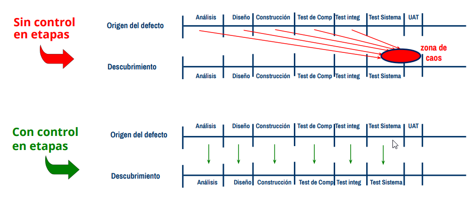
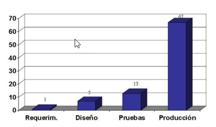

# Fundamentos del Testing

En este apartado se explican los principios básicos del testing de software:

## Índice

- [Principio 1 - La prueba muestra la presencia de defectos](#principio-1---la-prueba-muestra-la-presencia-de-defectos)
- [Principio 2 - La exhaustividad es imposible](#principio-2---la-exhaustividad-es-imposible)
- [Principio 3 - Detección temprana de defectos](#principio-3---detección-temprana-de-defectos)
- [Principio 4 - Agrupamiento de defectos](#principio-4---agrupamiento-de-defectos)
- [Principio 5 - Paradoja del pesticida](#principio-5---paradoja-del-pesticida)
- [Principio 6 - Es dependiente del contexto](#principio-6---es-dependiente-del-contexto)
- [Principio 7 - La ausencia de defectos es una falacia](#principio-7---la-ausencia-de-defectos-es-una-falacia)

---

## Principio 1 - La prueba muestra la presencia de defectos

### Muestra la presencia de defectos

La prueba puede mostrar la presencia de defectos, pero no garantiza que no existan. Las pruebas reducen la probabilidad de que queden defectos no descubiertos en el software, pero incluso si no se encuentran defectos, el proceso de prueba no demuestra la corrección total del sistema.

---

## Principio 2 - La exhaustividad es imposible

### La exhaustividad no es posible

Un ejemplo práctico:

¿Cuántos números serían necesarios para probar un DNI? Podrían ser: 1, 2, 3, 890.999, 27.5454.55, etc.

**Respuesta:** Para asegurar que cumple, se necesitarían millones de pruebas.

Por ello, se emplean técnicas que minimizan drásticamente la cantidad de pruebas necesarias.

---

## Principio 3 - Detección temprana de defectos

### Importancia de la detección temprana

La detección temprana de defectos es fundamental en el desarrollo de software. Identificar errores en las primeras etapas permite corregirlos antes de que se conviertan en problemas más complejos y costosos.

**¿En qué etapa es más costoso encontrar un defecto?**

- El tester encuentra los defectos durante las pruebas unitarias.
- El tester encuentra los defectos durante las pruebas a nivel de sistema.
- El usuario encuentra los defectos en producción. ✅
- El usuario encuentra los defectos durante las pruebas de aceptación.

Cuanto más tarde se detecta un defecto, mayor es el impacto en tiempo, esfuerzo y coste. Invertir en pruebas desde el inicio mejora la calidad y reduce riesgos.

---

## Principio 4 - Agrupamiento de defectos

### Agrupamiento de defectos

Los defectos suelen estar asociados a la complejidad de los requisitos, del proceso de negocio o a la complejidad ciclomatica del software. Es común observar que a mayor complejidad, mayor es el nivel de defectos encontrados.

---

## Principio 5 - Paradoja del pesticida

### Paradoja del pesticida

Si las pruebas se repiten una y otra vez, eventualmente dejarán de encontrar nuevos defectos. Para detectar nuevos defectos, es necesario cambiar las pruebas y los datos utilizados. Las pruebas repetitivas pierden efectividad, al igual que los pesticidas dejan de ser efectivos con el tiempo.

---

## Principio 6 - Es dependiente del contexto

### Depende del contexto

Las pruebas se realizan de manera diferente según el contexto. Por ejemplo, las pruebas se desarrollan de manera distinta en marcos predecibles que en frameworks ágiles.

---

## Principio 7 - La ausencia de defectos es una falacia

### La ausencia de defectos es una falacia

La ausencia de errores es una falacia, es decir, una creencia equivocada. Las pruebas contribuyen a minimizar los defectos en gran medida, pero no garantizan que se eliminen al 100%.

---

[⬅️ Volver al índice del módulo](../modulo1_principios_fundamentos.md) | [🏠 Menú principal](../README.md)
