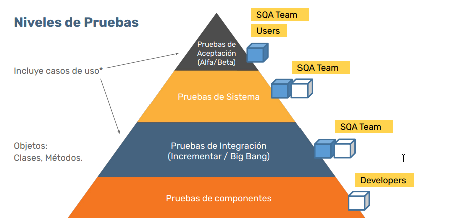
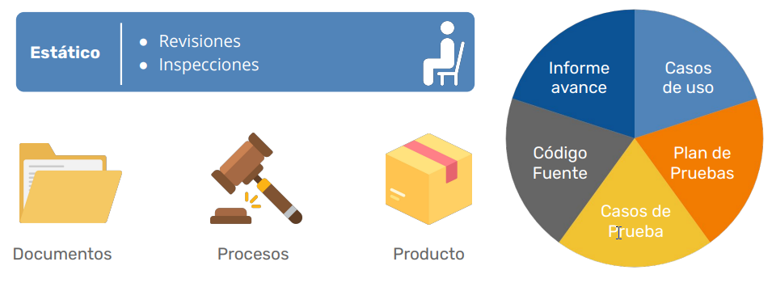
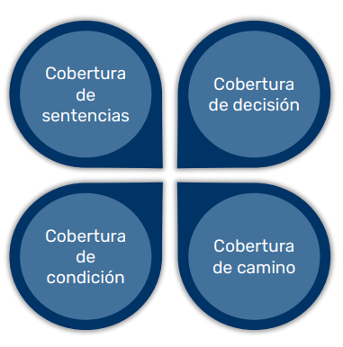
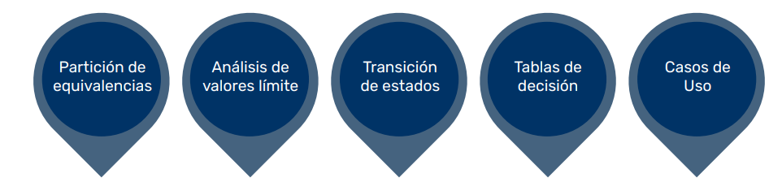

# Tipos y Técnicas de Pruebas

En este documento se describen los principales tipos y técnicas de pruebas de software, organizados por niveles, enfoques y objetivos.

## Índice

1. [Tipos de prueba](#tipos-de-prueba)
2. [Niveles de prueba](#niveles-de-prueba)
3. [Pruebas no funcionales](#pruebas-no-funcionales)
4. [Pruebas estructurales y asociadas al cambio](#pruebas-estructurales-y-asociadas-al-cambio)
5. [Enfoques y tipos de pruebas](#enfoques-y-tipos-de-pruebas)
6. [Enfoque estático: tipos y técnicas](#enfoque-estático-tipos-y-técnicas)
7. [Enfoque dinámico: técnicas de caja blanca](#enfoque-dinámico-técnicas-de-caja-blanca)
8. [Enfoque dinámico: técnicas de caja negra](#enfoque-dinámico-técnicas-de-caja-negra)
9. [Enfoque dinámico: técnicas basadas en experiencia](#enfoque-dinámico-técnicas-basadas-en-experiencia)

---

## Tipos de prueba

Las pruebas funcionales verifican que el sistema, módulo o componente cumpla con los requerimientos funcionales o casos de uso (UML). Estas pruebas pueden realizarse en todos los niveles:

- Componentes
- Integración
- Sistemas
- Aceptación

---

## Niveles de prueba

Los niveles de prueba representan las distintas etapas en las que se verifica la calidad del software. Incluyen:

1. **Pruebas de componentes:** Evalúan unidades individuales del software, como funciones o clases, para asegurar que funcionan correctamente de manera aislada.
2. **Pruebas de integración:** Verifican la interacción entre componentes o módulos, comprobando que colaboran correctamente.
3. **Pruebas de sistema:** Prueban el sistema completo para asegurar que cumple con los requisitos especificados.
4. **Pruebas de aceptación:** Validan que el sistema satisface las necesidades y expectativas del usuario final.

---

## Pruebas no funcionales

Estas pruebas verifican aspectos técnicos necesarios para el funcionamiento del sistema. Incluyen:

- Performance, carga, estrés
- Usabilidad
- Mantenibilidad
- Fiabilidad
- Portabilidad
- Preparación operacional
- Deployment

---

## Pruebas estructurales y asociadas al cambio

### Estructurales

Verifican la arquitectura del sistema.

### Asociadas al cambio

Evalúan el sistema después de la resolución de defectos. Incluyen:

- **Test de regresión:** Aseguran que los cambios no introduzcan nuevos defectos.
- **Re-test:** Verifican que los defectos corregidos ya no ocurren.

---

## Enfoques y tipos de pruebas

### Enfoque estático

- Revisiones
- Inspecciones

### Enfoque dinámico

- Caja blanca
- Caja negra
- Basada en experiencia

---

## Enfoque estático: tipos y técnicas

El enfoque estático incluye actividades como revisiones e inspecciones para identificar defectos sin ejecutar el software.

---

## Enfoque dinámico: técnicas de caja blanca

Las técnicas de caja blanca evalúan la estructura interna del software. Ejemplos incluyen:

- Cobertura de sentencias
- Cobertura de decisiones

---

## Enfoque dinámico: técnicas de caja negra

Las técnicas de caja negra evalúan la funcionalidad del software sin considerar su estructura interna. Ejemplos incluyen:

- Partición de equivalencia
- Análisis de valores límite
- Transicion de datos
- Tablas de decision
- Casos de uso

---

## Enfoque dinámico: técnicas basadas en experiencia

Estas técnicas se basan en el conocimiento y la intuición del tester. Ejemplos incluyen:

- Pruebas exploratorias (Exploratory testing)
- Predicción de errores (Error guessing)

---

[⬅️ Volver al índice del módulo](../modulo1_principios_fundamentos.md) | [🏠 Menú principal](../README.md)