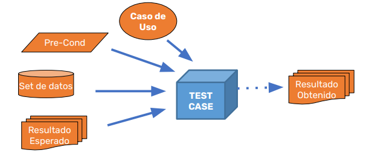
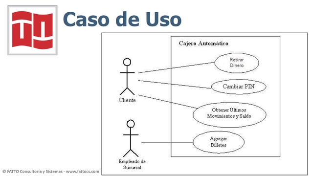
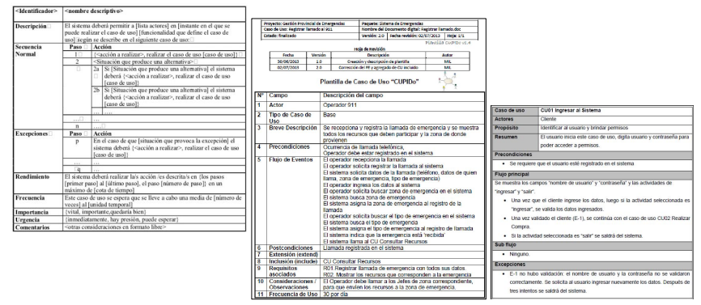
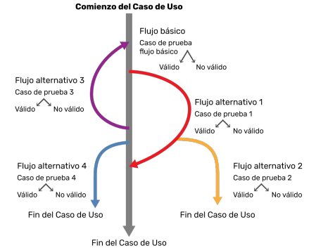
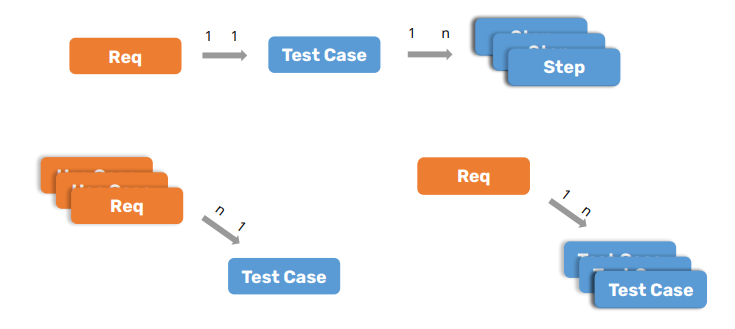
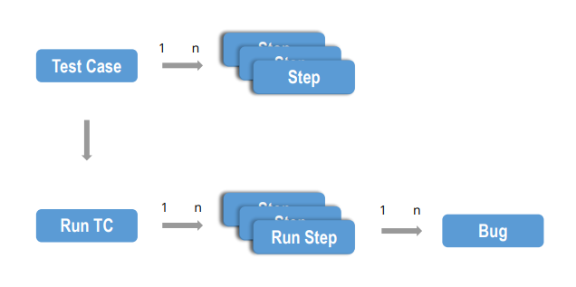

# 🧪 Concepto de Caso de Prueba

---

## 📑 Contenido

- [📌 Definición de Caso de Prueba](#-definición-de-caso-de-prueba)
- [🧱 Esquema y Características](#-esquema-y-características)
- [🧠 Cómo Diseñar Casos de Prueba](#-cómo-diseñar-casos-de-prueba)
- [🔍 Casos de Uso](#-casos-de-uso)
- [🔄 Casos de Uso vs Casos de Prueba](#-casos-de-uso-vs-casos-de-prueba)
- [🧬 Diagrama de Relación de Caso de Prueba](#-diagrama-de-relación-de-caso-de-prueba)

---

## 📌 Definición de Caso de Prueba

Un **caso de prueba** es un conjunto de condiciones, datos de entrada, precondiciones, acciones a ejecutar, resultados esperados y postcondiciones, que permiten verificar que un sistema o componente funcione correctamente bajo una situación específica.

Los casos de prueba se diseñan con el objetivo de:

- Validar el cumplimiento de un requisito funcional.
- Comprobar la correcta ejecución de un flujo o escenario.
- Detectar errores o desviaciones en la funcionalidad esperada.

---

## 🧱 Esquema y Características

### 📐 Esquema de un Caso de Prueba

Incluye, entre otros, los siguientes elementos:

- **ID único**
- **Título o nombre**
- **Descripción**
- **Precondiciones**
- **Pasos a seguir**
- **Datos de entrada**
- **Resultado esperado**
- **Ambiente de ejecución**
- **Prioridad y estado**
- **Historial de ejecución**

📷 *Ejemplo gráfico del entorno de pruebas:*

---

### 🧾 Características Clave de un Buen Caso de Prueba

1. Está identificado de forma única.
2. Es claro, preciso y sin ambigüedades.
3. Tiene un estado asociado (Pendiente, Aprobado, Fallido).
4. Es reutilizable en diferentes ciclos de prueba.
5. Incluye versión del sistema bajo prueba.
6. Permite el seguimiento del progreso de pruebas.
7. Registra autor, fecha de creación y de ejecución.
8. Soporta historial de resultados por ejecución.
9. Puede priorizarse según la criticidad del caso.
10. Indica tiempos estimados de ejecución.
11. Es independiente del entorno técnico donde se ejecuta.

---

## 🧠 Cómo Diseñar Casos de Prueba

Pasos recomendados:

1. Analizar el requerimiento funcional o caso de uso.
2. Documentar flujos principales, alternativos y excepciones.
3. Seleccionar un escenario de prueba representativo.
4. Definir precondiciones claras.
5. Generar o seleccionar los datos de entrada necesarios.
6. Establecer el/los ambientes de prueba apropiados.
7. Documentar claramente los resultados esperados.

---

## 🔍 Casos de Uso

Un **caso de uso** describe las interacciones entre un actor (usuario o sistema externo) y el sistema, para lograr un objetivo específico.

Se utiliza para:

- Representar visualmente los requerimientos del sistema.
- Especificar el comportamiento esperado ante ciertos eventos.
- Guiar el diseño de pruebas funcionales.

📷 *Ejemplo gráfico:*

### ✍️ Ejemplo de Descripción de Caso de Uso

---

## 🔄 Casos de Uso vs Casos de Prueba

- **Casos de uso**: Representan lo que el sistema **debe hacer** desde el punto de vista del usuario.
- **Casos de prueba**: Verifican que lo que **se implementó** cumpla con los casos de uso y requisitos.

📷 *Ejemplo de flujo de caso de uso:*

---

## 🧬 Diagrama de Relación de Caso de Prueba

### 📊 Diagrama de Caso de Prueba (DER)

Visualiza cómo los casos de prueba se relacionan con requerimientos o funcionalidades.

### 📈 Diagrama de Caso de Prueba Ejecutado

Muestra la evolución de ejecuciones para un mismo caso:

---

[⬅️ Volver al índice del módulo](../modulo2_Casos%20de%20prueba.md) | [🏠 Menú principal](../README.md)
