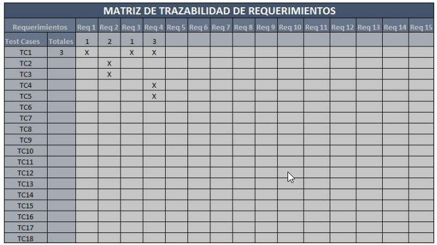

# 📌 Matriz de Trazabilidad y Tips para el Diseño de Casos de Prueba

## 📚 Contenido

- [📊 Matriz de Trazabilidad](#matriz-de-trazabilidad)
- [🧠 Tips para diseñar casos de prueba](#tips-para-diseñar-casos-de-prueba)

---

## 📊 Matriz de Trazabilidad

La matriz de trazabilidad es una herramienta clave que permite **rastrear la relación entre los requisitos del sistema y los casos de prueba** asociados. Su objetivo principal es asegurar que **cada requisito funcional esté cubierto por al menos un caso de prueba**, garantizando una validación completa del sistema.

| 🧾 Requisito | ✅ Caso(s) de Prueba |
|-------------|----------------------|
| REQ-01      | CP-01, CP-02         |
| REQ-02      | CP-03                |

📌 *Ejemplo visual:*  

---

## 🧠 Tips para Diseñar Casos de Prueba

A continuación, se listan buenas prácticas que debes seguir al momento de diseñar casos de prueba efectivos y claros:

1. 🔹 **Defina una acción clara por paso:** Evite instrucciones compuestas.
2. 🔹 **Use tareas simples y específicas:** Facilita la ejecución y revisión.
3. 🔹 **Utilice verbos en infinitivo:** Por ejemplo: “Ingresar usuario”, “Seleccionar opción”.
4. 🔹 **Evite faltas de ortografía y ambigüedades:** Mejora la comprensión y profesionalismo.
5. 🔹 **Escriba en lenguaje claro y universal:** Piensa en un ejecutor que no conoce el sistema.
6. 🔹 **Póngase en el lugar de otro lector:** Los CP deben poder ser entendidos por cualquier persona del equipo.
7. 🔹 **Nombre descriptivo para cada CP:** Debe indicar la funcionalidad y el objetivo evaluado.
8. 🔹 **Casos negativos deben iniciar con "Intentar":** Ej. “Intentar registrar sin contraseña”.
9. 🔹 **Evite duplicar ID o nombres de CP:** Cada uno debe ser único y trazable.
10. 🔹 **Prefiera varios CP con pocos pasos que uno complejo:** Mejora la modularidad y mantenimiento.
11. 🔹 **Realice revisión cruzada de CP:** Idealmente, quien los diseña no debe ser quien los aprueba.
12. 🔹 **Incluya precondiciones y datos claros:** Cada CP debe indicar qué se necesita antes de ejecutarlo.
13. 🔹 **Valide con casos frontera y excepcionales:** Para cubrir condiciones fuera del camino feliz.

📌 *Recuerda:* Un buen caso de prueba no solo verifica el sistema, también documenta cómo se espera que funcione.

---

[⬅️ Volver al índice del módulo](../modulo2_Casos%20de%20prueba.md) | [🏠 Menú principal](../README.md)
