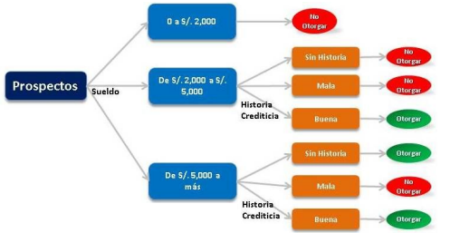
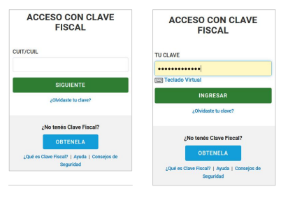
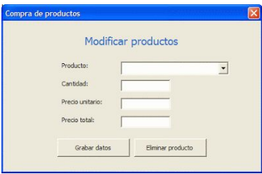

# 📝 Desafío – Diseño de Casos de Prueba

En este desafío trabajaremos con tres escenarios distintos para **identificar casos de prueba positivos y negativos**, aplicando buenas prácticas de QA.

---

## 🌳 Ejercicio 1 – Árbol de decisión para otorgar dinero

**Objetivo:**  
A partir del siguiente **árbol de decisión** para el otorgamiento de dinero, generar una lista de **casos de prueba positivos** (cuando se otorga el crédito) y **casos de prueba negativos** (cuando no se otorga).  

---

## 🔐 Ejercicio 2 – Acceso al portal AFIP

**Objetivo:**  
Dada la siguiente pantalla de acceso al portal de **AFIP**, generar una lista de **casos de prueba positivos y negativos**.  
Para la definición de resultados esperados, se recomienda acceder a la sección **Contribuyente** de la [AFIP](https://auth.afip.com.ar/contribuyente_/login.xhtml) y observar el comportamiento real de la aplicación.

---

## 🛒 Ejercicio 3 – Modificación de productos

**Objetivo:**  
A partir de la siguiente pantalla, generar una lista de **casos de prueba positivos y negativos** relacionados con la modificación de productos en un sistema de compras.

**Consideraciones:**  

- El producto ya debe estar grabado previamente.  
- El campo **Producto** es un desplegable desde el cual se selecciona el ítem a modificar.  
- Al seleccionar un producto, el resto de los campos se completan automáticamente para su edición.

---

[⬅️ Volver al índice del módulo](../modulo2_Casos%20de%20prueba.md) | [🏠 Menú principal](../README.md)
