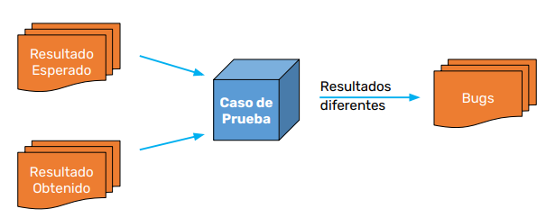
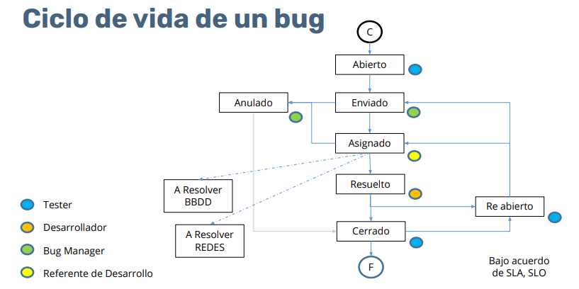

# Gestión de Defectos

En este módulo se abordan los conceptos y procesos para la **identificación, reporte, seguimiento y cierre de defectos** durante el ciclo de vida del software.

---

## Contenido

1. [Definición de Bug](#definición-de-bug)
2. [Comparación de Anomalía según IEEE](#comparación-de-anomalía-según-ieee)
3. [Esquema de un Bug](#esquema-de-un-bug)
4. [Impacto de un Defecto](#impacto-de-un-defecto)
5. [Cómo Registrar Bugs](#cómo-registrar-bugs)
6. [Ejercicio: Cómo se Comunica un Defecto](#ejercicio-cómo-se-comunica-un-defecto)
7. [Ciclo de Vida de un Bug](#ciclo-de-vida-de-un-bug)

---

## Definición de Bug

Un **bug** es una **imperfección en un componente o sistema** que puede causar que el mismo falle al desempeñar las funciones requeridas.  
Ejemplo: una sentencia incorrecta en el código o una definición de datos errónea.

> En el contexto de pruebas de software, **bug**, **defecto** y **error** suelen usarse como sinónimos, aunque pueden tener matices diferentes dependiendo del estándar o metodología.

---

## Comparación de Anomalía según IEEE

**Anomalía:**  
> Cualquier condición que se desvíe de las expectativas basadas en las especificaciones de requisitos, documentos de diseño, manuales de usuario, estándares, o de la experiencia y percepción de alguien.

**Características clave:**

- Puede ser detectada durante revisiones, pruebas, análisis, compilación o uso de un producto de software o documentación.
- Incluye **fallas**, **comportamientos inesperados**, y **desviaciones en el rendimiento**.
- No siempre implica un bug en el código; puede ser un problema en la documentación o un requisito mal definido.

---

## Esquema de un Bug

  
*El esquema puede incluir: entorno de pruebas, pasos para reproducir, evidencia, severidad y prioridad.*

---

## Impacto de un Defecto

Un defecto no corregido puede generar:

- Cambios en el **código** (correcciones o retrabajo).
- Modificaciones en el **diseño de casos de prueba**.
- Ajustes en los **requerimientos**.
- Alteraciones en el **cronograma** y en la planificación del proyecto.
- Costos adicionales en **tiempo** y **recursos**.

> **Regla de oro:** mientras antes se detecte y corrija un defecto, menor será el costo y el impacto en el proyecto.

---

## Cómo Registrar Bugs

1. **Analizar** la diferencia real entre lo esperado y lo obtenido.
2. **Verificar** si el defecto ya fue reportado.
3. Si existe y es la misma causa, **asociarlo** al caso de prueba correspondiente.
4. Si es nuevo, **crear un reporte** y vincularlo al caso de prueba.
5. **Documentar** con la mayor cantidad posible de información útil:
   - Pasos para reproducir.
   - Evidencia (capturas de pantalla, videos, logs).
   - Severidad y prioridad.
   - Entorno de prueba (sistema operativo, navegador, versión del software, etc.).
6. **Comunicar** siguiendo el canal formal definido por el equipo.

---

## Ejercicio: Cómo se Comunica un Defecto

**Opciones (del mundo real a lo profesional):**

1. Informar verbalmente al desarrollador.  
   *(No recomendado, se pierde trazabilidad).*
2. Mandar mensajes informales o incluso de broma.  
   *(No recomendado, poco profesional).*
3. Enviar un correo masivo exponiendo el problema.  
   *(Riesgoso, puede generar conflictos innecesarios).*
4. **Reportar formalmente a través de la herramienta de gestión de bugs** (Jira, Redmine, Trello, etc.).  
   *(Recomendado, garantiza trazabilidad y seguimiento).*

---

## Ciclo de Vida de un Bug

**Fases comunes:**

1. **Nuevo (New):** El bug ha sido reportado y está pendiente de revisión.
2. **Asignado (Assigned):** Se asigna a un desarrollador para su análisis y corrección.
3. **En Progreso (In Progress):** El desarrollador trabaja en la solución.
4. **Resuelto (Resolved):** El bug ha sido corregido, pendiente de validación por QA.
5. **Verificado (Verified):** QA confirma que la solución es correcta.
6. **Cerrado (Closed):** El bug queda oficialmente cerrado.
7. **Reabierto (Reopened):** Si se detecta que la corrección no fue efectiva, el ciclo se reinicia.

> Un buen ciclo de vida de defectos asegura **trazabilidad**, **priorización correcta** y **mejor comunicación** entre QA y desarrollo.

---

[⬅️ Volver al índice del módulo](../modulo3_gestion_defectos.md) | [🏠 Menú principal](../README.md)
