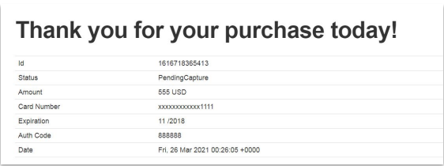
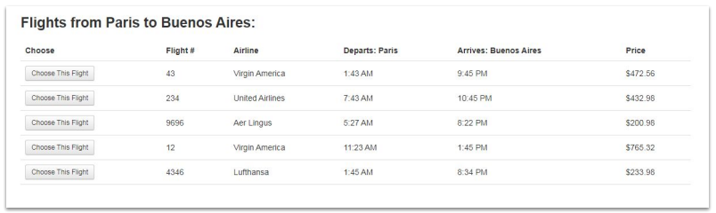
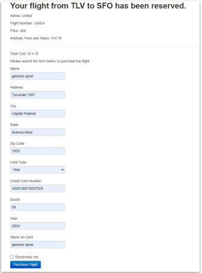
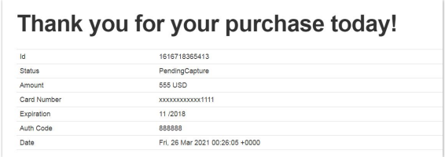

# Laboratorio 1 Resuelto: Reporte de Defectos

## Solución del Ejercicio 1

### Reporte de Fallas

**Cliente:** BLAZEDEMO  
**Requerimiento:** Compra de pasaje  

---

#### Defecto 1  

**ID:** CP003  
**Descripción:**  
Intentar comprar un vuelo sin completar el formulario.  
Pasos realizados:  

1. Seleccionar ciudad de salida: **París**  
2. Seleccionar ciudad de llegada: **Buenos Aires**  
3. Seleccionar el **primer vuelo** de la lista.  
4. Navegador: **Google Chrome**  

**Evidencia:**  
  
  

---

#### Defecto 2  

**ID:** CP005  
**Descripción:**  
Compra de un vuelo con discrepancia en el precio mostrado en la confirmación respecto al precio elegido.  

**Resultado esperado:**  

1. Mostrar el formulario para completar la compra del vuelo.  
2. Redirigir a la página: [https://www.blazedemo.com/confirmation.php](https://www.blazedemo.com/confirmation.php)  
3. Mostrar el mensaje: **"Thank you for your purchase hoy"**.  
4. En la parte inferior, mostrar los datos de la compra: *id, status, amount, card number, expiration, auth code y date*.  

**Resultado obtenido:**  

1. Selección del vuelo número **43** con precio de **472.53**.  
2. Redirección a la página de confirmación donde el costo total mostrado es **914.56**.  
3. Se muestra el formulario para completar la compra.  
4. Aparece el mensaje **"Thank you for your purchase today"**.  
5. Los datos de la compra en la parte inferior **no coinciden** con los datos ingresados en el formulario ni con los del vuelo seleccionado.  

**Evidencia:**  
  
  
  

---

[⬅️ Volver al índice del módulo](../modulo3_gestion_defectos.md) | [🏠 Menú principal](../README.md)
