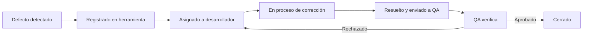

# Buenas Prácticas en la Gestión de Defectos

La **gestión de defectos** es el conjunto de actividades que permiten **identificar, registrar, priorizar, dar seguimiento y cerrar** los errores detectados en un sistema, producto o servicio.  
Su objetivo es **asegurar la calidad del software** y reducir riesgos en producción, manteniendo una comunicación clara entre **QA, desarrollo y stakeholders**.

---

## Principales Buenas Prácticas

### 1. Documentar Claramente Cada Defecto

- **Descripción detallada**: incluir contexto, pasos para reproducir, datos de entrada y condiciones del entorno.
- **Evidencia**: capturas de pantalla, grabaciones de video, logs del sistema.
- **Trazabilidad**: vincular el defecto con el caso de prueba, requerimiento y versión del sistema.

**Ejemplo:**
> *ID:* BUG-001  
> *Título:* El sistema permite iniciar sesión con contraseña vacía.  
> *Pasos para reproducir:*  
>
> 1. Ir a la pantalla de login.  
> 2. Ingresar un usuario válido.  
> 3. Dejar la contraseña en blanco y presionar "Ingresar".  
> *Resultado esperado:* Mostrar mensaje de error indicando que la contraseña es obligatoria.  
> *Resultado obtenido:* El sistema permite el acceso.  
> *Evidencia:* `captura_bug_001.png`

---

### 2. Priorizar Según Impacto y Urgencia
- **Impacto:** Qué tan grave es la consecuencia para el negocio o usuario final.
- **Urgencia:** Qué tan pronto debe corregirse el defecto.
- Utilizar una **matriz de priorización** (Alta, Media, Baja) combinada con **severidad** (Crítica, Mayor, Menor).

**Ejemplo de Clasificación:**
| Prioridad | Severidad | Ejemplo |
|-----------|-----------|---------|
| Alta      | Crítica   | El sistema no procesa pagos en producción. |
| Alta      | Mayor     | Error al generar facturas con ciertos caracteres especiales. |
| Media     | Mayor     | El módulo de reportes exporta a Excel con un formato incorrecto. |
| Baja      | Menor     | El logo está pixelado en la pantalla de inicio. |

---

### 3. Hacer Seguimiento Hasta el Cierre

- Asignar el defecto a un **responsable**.
- Monitorear el **estado**: Abierto → En Proceso → Resuelto → Verificado → Cerrado.
- Validar la **corrección** ejecutando nuevamente el caso de prueba.
- Cerrar el defecto solo con **evidencia de verificación**.

**Ejemplo de flujo:**

---

## 4. Comunicar Efectivamente con el Equipo

- Utilizar lenguaje objetivo y técnico en la descripción del bug.
- Evitar ambigüedades o juicios de valor.
- Mantener la información actualizada en la herramienta de seguimiento (Jira, - - Trello, Azure DevOps, etc.).
- Informar cambios relevantes en reuniones de seguimiento o mediante alertas automáticas.

**Ejemplo de mala comunicación:**

> "El sistema está mal, no funciona nada."

**Ejemplo de buena comunicación:**

> "Al generar un reporte de ventas para el rango 01/07/2025 - 31/07/2025, el sistema arroja un error 500. Este problema ocurre solo en ambiente de pruebas al seleccionar más de 1.000 registros."

---

### Beneficios de Aplicar Estas Prácticas

- Reducción de reprocesos.
- Mayor velocidad de resolución de defectos.
- Mejor comunicación entre equipos.
- Mayor trazabilidad y control de calidad.
- Incremento de la satisfacción del cliente.

---

### Recomendación Final

Una buena gestión de defectos no es solo detectar errores, sino crear un flujo de trabajo estructurado que permita:

1. Encontrar rápidamente la causa raíz.
2. Implementar la solución de forma controlada.
3. Prevenir que el mismo error se repita.

---

[⬅️ Volver al índice del módulo](../modulo3_gestion_defectos.md) | [🏠 Menú principal](../README.md)
