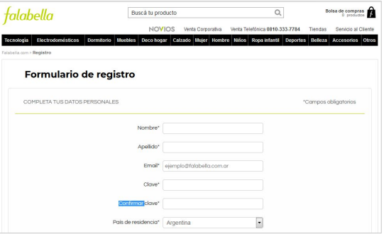
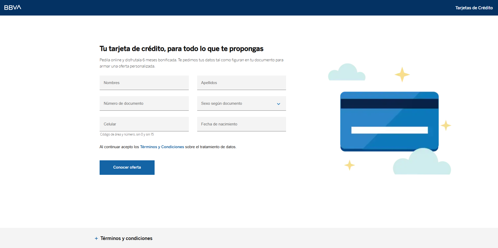
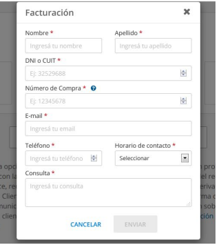

# 🏆 Desafío

A continuación se presentan tres ejercicios para analizar y detectar defectos en distintos sitios web. Observa cada caso, identifica los posibles problemas y enuméralos de forma clara.

---

## 1️⃣ Ejercicio 1: Formulario de registro — Falabella

Accede al formulario de registro en el sitio web de [Falabella](https://secure.falabella.com.ar/falabella-ar/myaccount/register.jsp) y enumera los defectos que encuentres.

---

## 2️⃣ Ejercicio 2: Ingreso de credenciales — BBVA

Ingresa al sitio web de [BBVA](https://www.bbva.com.ar/) y analiza la sección de ingreso de credenciales. Enumera los defectos detectados.

---

## 3️⃣ Ejercicio 3: Sección de facturación — Garbarino

Revisa la sección de facturación en el sitio web de [Garbarino](https://www.garbarino.com/shop) y enumera los defectos encontrados.

---

> **Tip:** Sé específico al describir cada defecto. Incluye detalles sobre el comportamiento observado, el resultado esperado y los pasos para reproducir el problema.
