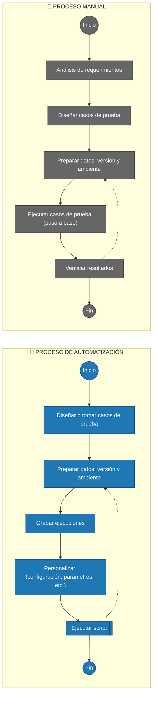
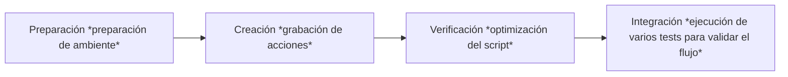

# Conceptos de automatización

## Contenido

- [Beneficios](#beneficios-de-un-test-automatizado)
- [Cuándo conviene automatizar](#cuándo-conviene-automatizar)
- [Usos de tests automatizados](#usos-de-tests-automatizados)
- [Características de un test automatizado](#características-de-un-test-automatizado)
- [Proceso de una automatización](#proceso-de-una-automatización)
- [Qué logramos](#qué-logramos-con-la-automatización)
- [Workflow](#workflow-de-una-automatización)

---

### Beneficios de un test automatizado

- Es autodocumentado
- Es más rápido
- Es repetible
- Es reutilizable
- El resultado no depende del tester (es objetivo)
- Es consistente
- Complementa los casos de prueba manuales
- Es un proyecto en sí mismo
- No sustituye el proceso manual
- Compatible con las buenas prácticas de programación

---

### Cuándo conviene automatizar

- Ejecución de casos de prueba repetitivos
- Uso de conjuntos de datos variados para el mismo caso de prueba
- Pruebas en varios ambientes
- Tests de regresión frecuentes

---

### Usos de tests automatizados

- Generación de datos de prueba
- Re-ejecución de casos de prueba
- Pruebas de regresión
- Pruebas de integración
- Verificación de ambientes
- Medición de tiempos de respuesta

---

### Características de un test automatizado

- Provee un entorno completo y fácil de usar
- Simplifica la creación y mantenimiento de casos de prueba
- Documenta la ejecución en tiempo real
- Permite insertar, modificar, parametrizar o eliminar pasos fácilmente
- Verifica datos mediante puntos de control (checkpoints)
- Controla eventos inesperados (escenarios de recuperación)
- Reconoce objetos en diferentes tecnologías (add-ins)

---

### Proceso de una automatización

---

### Qué logramos con la automatización

- **Rapidez:** Ejecución más rápida
- **Consistencia:** Evita errores humanos, siempre es igual
- **Repetibilidad:** Puede ejecutarse todas las veces que se requiera
- **Programabilidad:** Es configurable y programable
- **Cobertura:** Permite pruebas de regresión amplias
- **Reutilización:** Utilizable en diferentes versiones o ambientes

---

### Workflow de una automatización

---

[⬅️ Volver al índice del módulo](../modulo4_automatizacion.md) | [🏠 Menú principal](../README.md)
