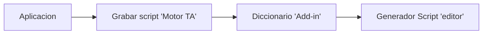
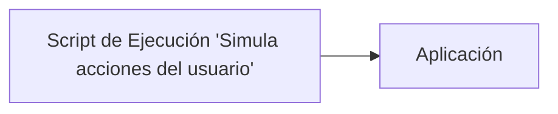
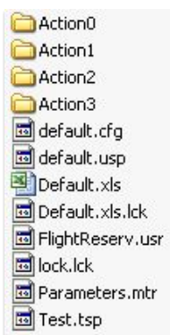
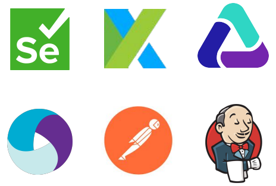

# Creación y ejecución

## Contenido

- [Cómo crear un script automatizado](#cómo-crear-un-script-automatizado)
- [Cómo ejecutar un script automatizado](#cómo-ejecutar-un-script-automatizado)
- [Estructura de un script](#estructura-de-un-script)
- [Funcionalidades para la programación automatizada](#funcionalidades-para-la-programación-automatizada)
- [Herramientas y frameworks de automatización](#herramientas-y-frameworks-de-automatización)

---

### Cómo crear un script automatizado

1. Abrir la herramienta de automatización.
2. Seleccionar los add-ins necesarios.
3. Preparar el caso de prueba (CP).
4. Configurar la aplicación bajo prueba.
5. Activar el modo grabación.
6. Ejecutar el caso de prueba en modo grabación.
7. Detener la grabación.

El usuario realiza el proceso a automatizar sobre la aplicación mientras la herramienta registra las acciones.

---

### Cómo ejecutar un script automatizado

1. Abrir la herramienta de automatización.
2. Cargar el script a ejecutar.
3. Activar el modo ejecución (Run).
4. Guardar y analizar los resultados obtenidos.

---

### Estructura de un script

Dentro de la carpeta de un script automatizado se pueden encontrar:

- Archivo principal con el código del script.
- Planilla Excel o archivo de datos de prueba.
- Archivo de concurrencia para evitar ejecuciones simultáneas.
- Archivos de configuración adicionales.

> **Nota:**  
> Los scripts pueden exportarse y comprimirse en formato ZIP para su distribución.

Ejemplo de estructura en UFT:

---

### Funcionalidades para la programación automatizada

1. **CheckPoint:** Puntos de verificación para validar resultados.
2. Manipulación de métodos y propiedades de objetos.
3. Objetos de control (imágenes, texto, XML, tablas).
4. Parámetros o variables (numéricas, aleatorias, variables de entorno como filename, testname, testpath, versión de S.O., expresiones regulares).
5. Obtención de datos desde fuentes externas (bases de datos, archivos).
6. Manejo de excepciones (eventos inesperados y errores durante la ejecución).
7. Uso de funciones y llamadas a métodos.
8. Registro y reporte de resultados de ejecución.
9. Debugging y generación de logs.
10. Sentencias condicionales y bucles.

---

### Herramientas y frameworks de automatización

Frameworks más utilizados:

- Selenium
- Cypress
- Playwright
- Appium
- Robot Framework
- TestNG
- JUnit
- Cucumber
- UFT (Unified Functional Testing)
- Katalon Studio
- Puppeteer
- SpecFlow
- Serenity BDD

Lenguajes compatibles:

- Python
- Java
- Ruby
- C++
- C#
- VBScript
- JavaScript/TypeScript
- Selenese
- ...

> **Nota:**  
> La elección del framework y lenguaje depende del tipo de aplicación, el entorno y los requisitos del proyecto.

---

[⬅️ Volver al índice del módulo](../modulo4_automatizacion.md) | [🏠 Menú principal](../README.md)
