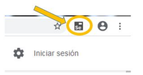
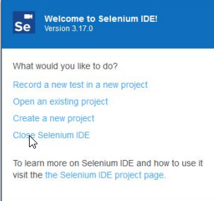
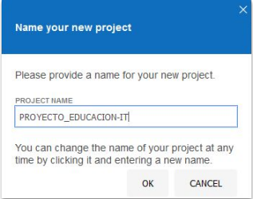
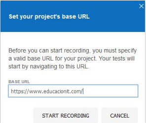
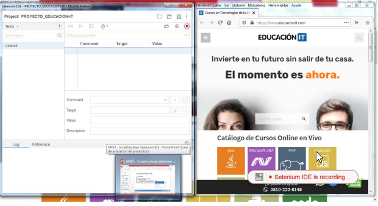
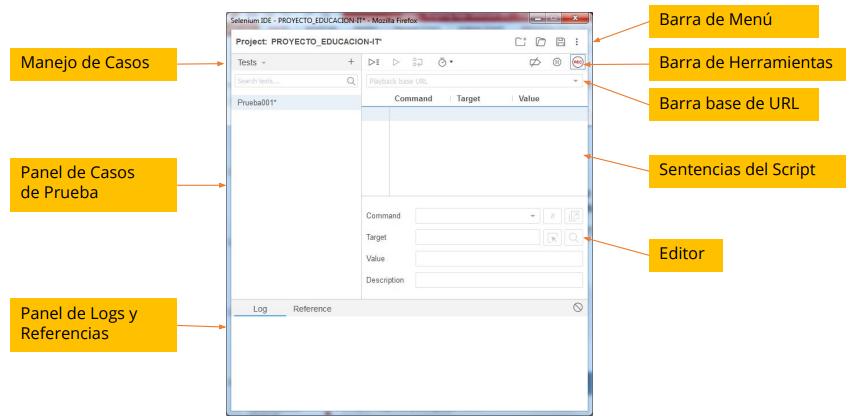

# Scripting bajo Selenium IDE

## Contenido

- [¿Qué es Selenium?](#qué-es-selenium)
- [Características de Selenium IDE](#características-de-selenium-ide)
- [Instalación de Selenium IDE](#instalación-de-selenium-ide)
- [Ejecutar Selenium IDE](#ejecutar-selenium-ide)
- [Iniciar Selenium IDE](#iniciar-selenium-ide)
- [Entorno de Selenium IDE](#trabajar-en-el-entorno-selenium-ide)
- [Ejercicios](#ejercicio-selenium-ide)

---

### ¿Qué es Selenium?

**Selenium** es un entorno de pruebas de software para aplicaciones web. Proporciona una herramienta de grabación/reproducción (Selenium IDE) que permite crear pruebas sin necesidad de escribir código.

Incluye también un lenguaje específico de dominio para pruebas (Selenese), que permite escribir scripts en varios lenguajes populares como Java, C#, Ruby, Groovy, Perl, PHP y Python. Las pruebas pueden ejecutarse en la mayoría de los navegadores modernos y sistemas operativos como Windows, Linux y macOS.

Selenium IDE es un entorno de desarrollo integrado para pruebas con Selenium, disponible como extensión para Firefox y Chrome. Permite grabar, editar y depurar pruebas de manera sencilla. Originalmente se conocía como Selenium Recorder.

Puedes crear scripts automáticamente mediante la grabación y luego editarlos manualmente para ajustar comandos y sentencias, asegurando la correcta reproducción de las pruebas.

---

### Características de Selenium IDE

- Grabación y reproducción sencilla
- Selección inteligente de campos usando ID, nombre o XPath
- Autocompletado de los comandos más comunes de Selenium
- Depuración y puntos de verificación (breakpoints)
- Almacenamiento de pruebas en formatos como Selenese, Ruby, Java y otros
- Soporte para el archivo user-extensions.js
- Opción para validar el título de la página

---

### Instalación de Selenium IDE

1. Accede al sitio oficial: [https://www.selenium.dev/downloads/](https://www.selenium.dev/downloads/)
2. Desplázate hasta la sección de Selenium IDE.
3. Haz clic en el enlace de la versión para Firefox o Chrome, según tu navegador.
4. Presiona "Añadir a Firefox" o "Añadir a Chrome" en la pantalla de complementos.
5. Confirma la instalación de la extensión.

> **Nota:**  
> Verifica que el icono de Selenium aparezca en la esquina superior derecha del navegador.

---

### Ejecutar Selenium IDE

1. Haz clic en el icono de Selenium en la esquina superior derecha del navegador.

> **Nota:**  
> Se abrirá la ventana del entorno de trabajo de Selenium.

---

### Iniciar Selenium IDE

Al abrir Selenium IDE, tienes cuatro opciones principales:

1. Ingresar un nuevo test en un proyecto nuevo
2. Abrir un proyecto existente
3. Crear un nuevo proyecto (sin comenzar la grabación)
4. Salir de la aplicación o complemento

Si seleccionas la opción 1 (nuevo test en proyecto nuevo), debes ingresar:

1. Nombre del proyecto

2. Página web de inicio del test

---

### Trabajar en el entorno Selenium IDE

Al iniciar, se abren dos ventanas:

1. Entorno de trabajo de Selenium IDE
2. Sitio web a testear en modo grabación

Vista del entorno de Selenium IDE:

---

### Ejercicio: Selenium IDE

Practica la dinámica del curso seleccionando diferentes sitios web para realizar pruebas de automatización con Selenium IDE.

---

[⬅️ Volver al índice del módulo](../modulo4_automatizacion.md)  
[🏠 Menú principal](../README.md)
