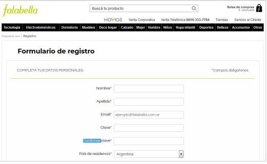
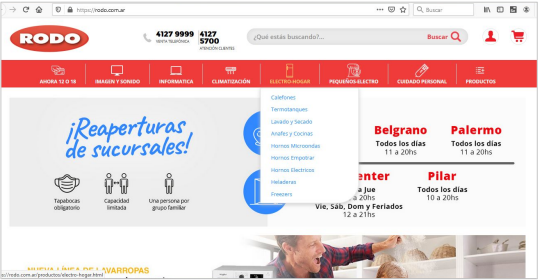
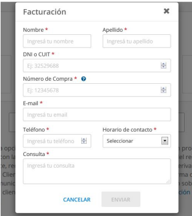

# Desafío

## Ejercicio 1

Automatiza el formulario de registro en la página de [Falabella](https://secure.falabella.com.ar/falabella-ar/myaccount/register.jsp?CJSESSIONID=6ovKyMizQXwmMcGtNej45EEo.node3205&CURRENCYCODE=ARS&fromPage=&DPSLogout=true).

**Consideraciones:**  
Dado que las páginas pueden actualizarse frecuentemente, realiza la práctica utilizando Selenium IDE (técnica Record & Play) y adjunta los resultados obtenidos.

---

## Ejercicio 2

Automatiza el proceso de búsqueda y compra en el e-commerce de [Rodo](https://www.rodo.com.ar/), considerando las diferentes formas de buscar productos en la plataforma.

**Consideraciones:**  
Debido a las posibles actualizaciones del sitio, utiliza Selenium IDE (técnica Record & Play) y adjunta los resultados.

---

## Ejercicio 3

Automatiza el proceso de facturación en el sitio web de [Garbarino](https://www.garbarino.com/ayuda).

**Consideraciones:**  
Como las páginas pueden cambiar, realiza la práctica con Selenium IDE (técnica Record & Play) y adjunta los resultados.

---

[⬅️ Volver al índice del módulo](../modulo4_automatizacion.md)  
[🏠 Menú principal](../README.md)
