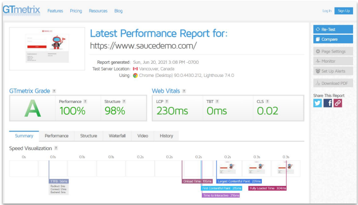
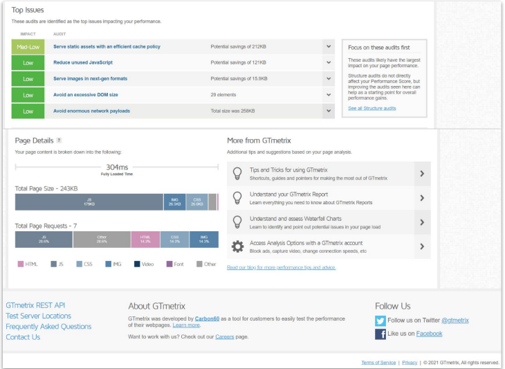
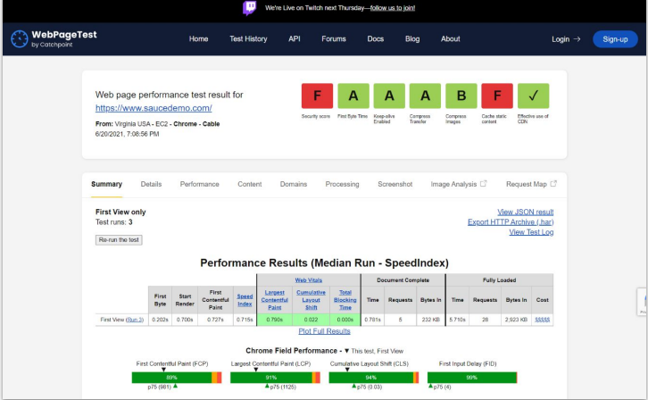
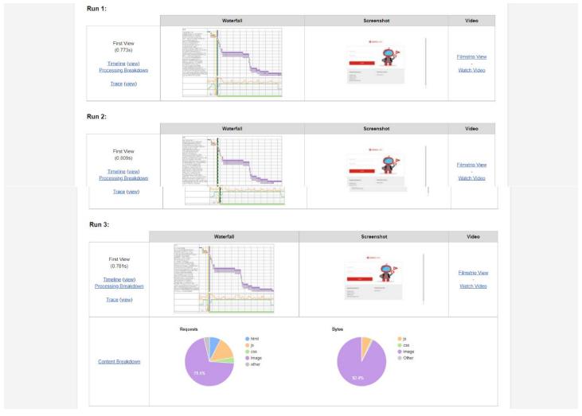
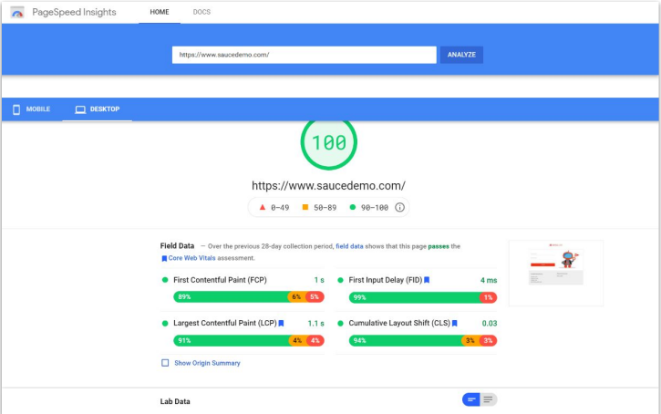
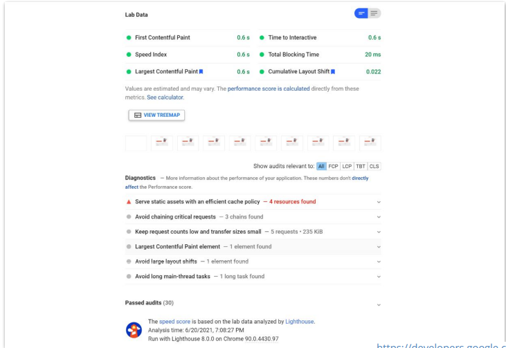

# Laboratorio adicional resuelto

## Solución del ejercicio

A continuación se presentan los resultados obtenidos al realizar pruebas de performance utilizando las herramientas indicadas. Se muestran capturas de pantalla que ilustran el análisis realizado sobre los distintos sitios web evaluados.

---

[⬅️ Volver al índice del módulo](../modulo5_pruebas_no_funcionales.md)  
[🏠 Menú principal](../README.md)
