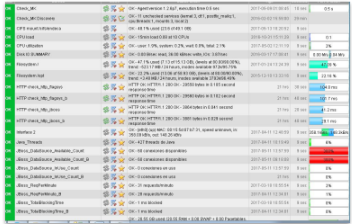
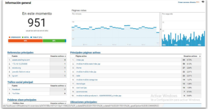
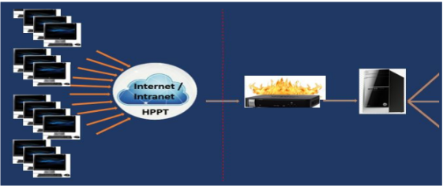
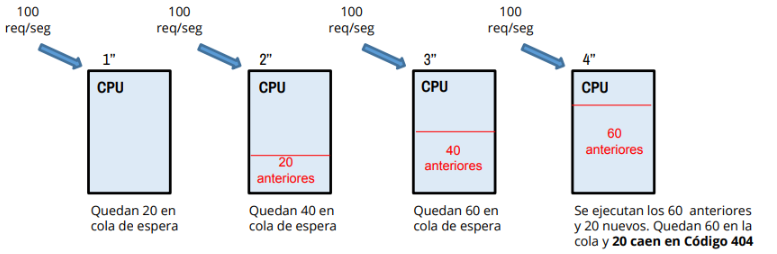

# Test de carga

## Contenido

- ¿Qué es un test de carga?
- Conceptos
- Beneficios
- Desventajas
- Dónde aplica
- Herramientas de monitoreo que colaboran
- Ejercicio

---

## ¿Qué es un test de carga?

Una prueba de carga se realiza para observar el comportamiento de una aplicación bajo una cantidad de peticiones esperada (número de usuarios concurrentes que realizan transacciones específicas durante un tiempo determinado). El objetivo es identificar cómo responde el sistema ante diferentes niveles de demanda y asegurar que cumple con los requisitos de rendimiento.

---

### Conceptos del test de carga

- Evalúa el comportamiento del sistema ante distintos volúmenes de carga.
- Mide el tiempo que le lleva al sistema ejecutar acciones y funciones en condiciones normales y de pico.
- Determina cuántos usuarios y/o transacciones puede soportar un sistema sin dejar de alcanzar un rendimiento adecuado.
- Permite identificar cuellos de botella y puntos críticos en la infraestructura.

---

### Beneficios del test de carga

- Anticipa cargas típicas y picos de uso.
- Detecta problemas de concurrencia y escalabilidad.
- Identifica errores de funcionalidad que aparecen bajo carga.
- Permite optimizar recursos y mejorar la experiencia del usuario.

---

### Desventajas del test de carga

- El ambiente puede ser inestable, lo que afecta la confiabilidad de las pruebas.
- Las pruebas pueden no estar enfocadas en la velocidad de respuesta si no se diseñan correctamente.
- Los resultados pueden no ser comparados adecuadamente con otras pruebas o ambientes.
- Requiere tiempo y recursos para configurar escenarios realistas.

---

### ¿Dónde aplica?

El test de carga puede aplicarse en diferentes componentes y recursos del sistema:

- Memoria RAM
- CPU
- Protocolo TCP/IP
- Red
- Manejo de archivos
- Bases de datos
- Servicios web y APIs
- Sistemas de almacenamiento

---

### Herramientas de monitoreo que colaboran

**Nagios:** Permite monitorear el estado de los recursos del sistema y alertar sobre posibles problemas de rendimiento.

**Google Analytics:** Ayuda a analizar el tráfico y el comportamiento de los usuarios en aplicaciones web.

**Otras herramientas útiles:**

- JMeter
- LoadRunner
- Grafana
- Prometheus

---

### Ejercicio

1. ¿Cómo pruebo 100 usuarios concurrentes?

¿Es suficiente correr los 100 usuarios en 1 segundo? ¿Qué opinas?

La capacidad de resolver todas las peticiones antes del time-out no garantiza que el sistema soporte realmente 100 usuarios concurrentes. Si no existe otra carga adicional, el sistema puede responder bien, pero no refleja un escenario realista.

**Respuesta:** Las pruebas de carga deben realizarse durante periodos prolongados y con diferentes patrones de concurrencia para obtener resultados representativos.

---

#### Ejercicio Gráfico

**CPU:** Ejecuta 80 requests por segundo.  
**Cola de espera:** Puede almacenar 60 requests.

Secuencia de entrada de requests:

**Explicación:**  
Cuando la cantidad de requests supera la capacidad de procesamiento de la CPU, las peticiones se almacenan en la cola de espera. Si la cola se llena, las peticiones adicionales pueden perderse o generar errores, lo que indica un límite en la capacidad del sistema.

---

**Conclusión:**  
El test de carga es fundamental para garantizar la estabilidad y el rendimiento de las aplicaciones bajo condiciones reales de uso. Permite anticipar problemas y optimizar los recursos antes de que impacten a los usuarios finales.

---

[⬅️ Volver al índice del módulo](../modulo5_pruebas_no_funcionales.md)  
[🏠 Menú principal](../README.md)
