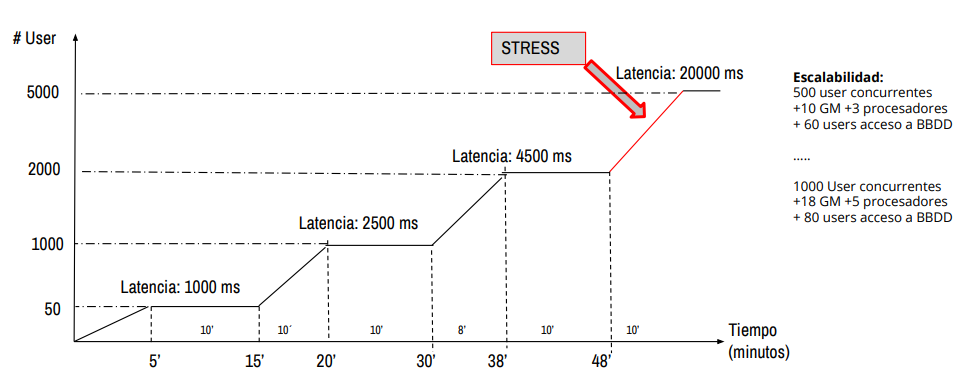

# Test de Estrés

## Contenido

- [¿Qué es un test de estrés?](#qué-es-un-test-de-estrés)
- [Conceptos](#conceptos-del-test-de-estrés)
- [Beneficios](#beneficios-del-test-de-estrés)
- [Desventajas](#desventajas-del-test-de-estrés)
- [Esquema de carga](#esquema-de-carga)
- [Otros tests no funcionales](#otros-tests-no-funcionales)
- [Herramientas](#herramientas-de-carga-y-estrés)

---

### ¿Qué es un test de estrés?

Esta prueba se utiliza para evaluar los límites de una aplicación, sometiéndola a cargas extremas hasta provocar su fallo. Consiste en incrementar progresivamente el número de usuarios o transacciones, ejecutando pruebas de carga hasta que el sistema deja de responder correctamente.

El objetivo principal es determinar la solidez y estabilidad de la aplicación en momentos de carga extrema. Ayuda a los administradores a prever si la aplicación rendirá adecuadamente en caso de que la carga real supere la carga esperada.

---

### Conceptos del test de estrés

- Mide el comportamiento del sistema ante niveles de actividad extremos, forzándolo hasta su caída.
- Simula la reducción de recursos del sistema (prueba negativa).
- Permite identificar cuellos de botella y componentes críticos.
- Verifica si las interrupciones y recuperaciones del sistema son aceptables (recuperación gradual o "graceful recovery").

---

### Beneficios del test de estrés

- Permite detectar posibles corrupciones de datos bajo condiciones de estrés extremo.
- Verifica que la seguridad del sistema no se vea comprometida ante situaciones límite.
- Ayuda a identificar fallos que pueden ocurrir en el umbral de colapso del sistema.

---

### Desventajas del test de estrés

- Los escenarios de prueba suelen ser poco realistas en comparación con el uso cotidiano.
- Son pruebas complejas y difíciles de implementar correctamente.
- El ambiente de pruebas suele ser compartido, lo que puede afectar la precisión de los resultados.

---

### Esquema de carga

---

### Otros tests no funcionales

- **Prueba de estabilidad (soak testing):**  
Evalúa si la aplicación puede soportar una carga esperada de manera continua durante largos periodos de tiempo.

- **Prueba de picos (spike testing):**  
Observa el comportamiento del sistema ante cambios drásticos y repentinos en la carga.

---

### Herramientas de carga y estrés

- [LoadRunner Professional](https://www.microfocus.com/en-us/products/loadrunner-professional/download)
- [Apache JMeter](https://jmeter.apache.org/download_jmeter.cgi)
- [Load Impact (k6)](https://loadimpact.com/)
- [Gatling](https://gatling.io/)
- [Artillery](https://www.artillery.io/)

---

[⬅️ Volver al índice del módulo](../modulo5_pruebas_no_funcionales.md)  
[🏠 Menú principal](../README.md)
