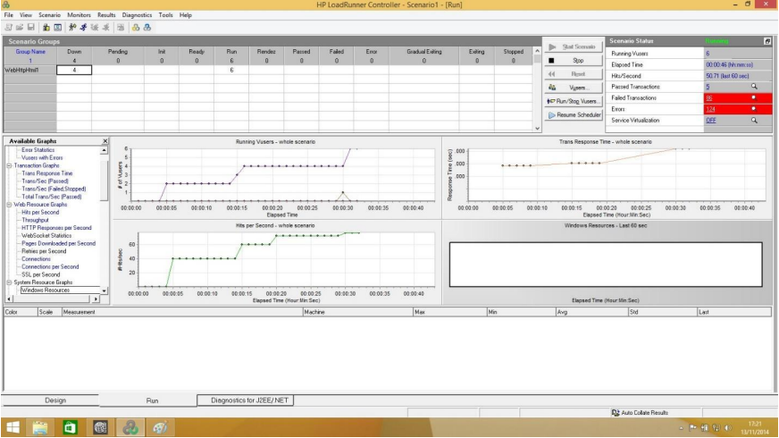
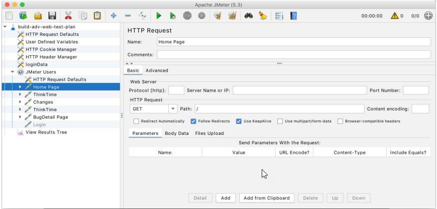

# Laboratorio adicional 3 resuelto

## Solución ejercicio 1

- [LoadRunner Professional](https://www.microfocus.com/en-us/products/loadrunner-professional/download)

LoadRunner Professional es una herramienta comercial especializada en la ejecución de pruebas de rendimiento sobre aplicaciones web, servicios y procesos empresariales. Permite simular miles de usuarios concurrentes para evaluar el comportamiento del sistema bajo diferentes cargas. Forma parte de una suite de herramientas de pruebas y se integra con sistemas de gestión de pruebas como ALM, facilitando el registro automático de resultados y la trazabilidad de los casos de prueba. Ofrece análisis detallados, generación de informes y visualización de métricas clave como tiempos de respuesta, uso de recursos y detección de cuellos de botella.

- [Apache JMeter](https://jmeter.apache.org/download_jmeter.cgi)

Apache JMeter es una herramienta gratuita y de código abierto, desarrollada en Java, que permite realizar pruebas de carga y rendimiento sobre aplicaciones web, servicios REST/SOAP, bases de datos, FTP y otros protocolos. Puede ejecutarse desde servidores o computadoras personales y es capaz de generar estadísticas sobre tiempos de respuesta, volumen de datos transferidos y tasas de error. Aunque su funcionalidad gráfica es limitada, puede integrarse con herramientas como Grafana para enriquecer la visualización de resultados. JMeter es ampliamente utilizado por su flexibilidad y facilidad de configuración.

- [Load Impact (k6)](https://loadimpact.com/) / [k6](https://k6.io/)

k6 es una herramienta moderna para pruebas de carga y estrés, disponible en versiones de código abierto y comercial. Permite diseñar y ejecutar escenarios de prueba mediante scripts en JavaScript, simulando miles de usuarios concurrentes para evaluar el rendimiento de APIs, servicios web y aplicaciones. k6 genera informes detallados y métricas amigables sobre el comportamiento del sistema, facilitando la integración con CI/CD y la automatización de pruebas en pipelines de desarrollo. Destaca por su facilidad de uso, escalabilidad en la nube y soporte para la monitorización continua del rendimiento.

---

[⬅️ Volver al índice del módulo](../modulo5_pruebas_no_funcionales.md)  
[🏠 Menú principal](../README.md)
