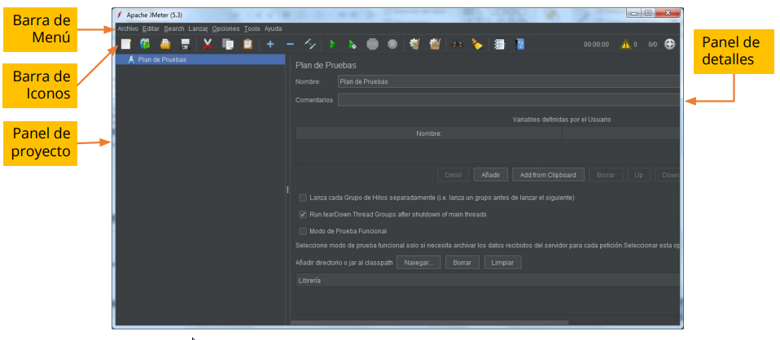

# Pruebas bajo JMeter

## Contenido

- [¿Qué es JMeter?](#qué-es-jmeter)
- [Instalación](#instalación-de-jmeter)
- [Ejecución](#ejecución-de-jmeter)
- [Ejercicio práctico](#ejercicio-práctico)

---

### ¿Qué es JMeter?

[JMeter](https://jmeter.apache.org/) es una herramienta de pruebas de carga y rendimiento desarrollada por Apache. Permite analizar y medir el comportamiento de aplicaciones web, servicios REST/SOAP, bases de datos, FTP y otros protocolos.  

JMeter soporta aserciones para validar que los datos recibidos sean correctos, por lo que también se utiliza para la automatización de pruebas funcionales. Es una herramienta flexible, multiplataforma y de código abierto, ampliamente utilizada en la industria para simular múltiples usuarios concurrentes y generar métricas detalladas sobre tiempos de respuesta, errores y consumo de recursos.

---

### Instalación de JMeter

1. Accede al sitio oficial de descarga: [https://jmeter.apache.org/download_jmeter.cgi](https://jmeter.apache.org/download_jmeter.cgi)
2. Desplázate hasta la sección "Binaries".
3. Descarga el archivo ZIP correspondiente, por ejemplo: `apache-jmeter-5.3.zip`.
4. Descomprime el archivo en una carpeta de tu preferencia.
5. Ingresa a la carpeta `bin`, por ejemplo: `C:\Clase5\apache-jmeter-5.3\bin`.
6. Ejecuta el archivo `jmeter.bat` (Windows) o `apacheJMeter.jar` (Java).

> **Importante:** Antes de instalar JMeter, asegúrate de tener instalada la versión 8 o superior de Java.

---

### Ejecución de JMeter

Para iniciar JMeter, ejecuta el archivo `jmeter.bat` desde la carpeta `bin`. Se abrirá la interfaz gráfica donde podrás crear planes de prueba, configurar escenarios de carga y visualizar resultados.

---

### Ejercicio práctico

Selecciona un sitio web o servicio y crea un plan de pruebas de carga utilizando JMeter. Configura diferentes escenarios de usuarios concurrentes, ejecuta las pruebas y analiza los resultados obtenidos.  
Puedes consultar la [documentación oficial de JMeter](https://jmeter.apache.org/usermanual/index.html) para aprender sobre la creación de planes de prueba, uso de aserciones y generación de reportes.

---

[⬅️ Volver al índice del módulo](../modulo5_pruebas_no_funcionales.md)  
[🏠 Menú principal](../README.md)
