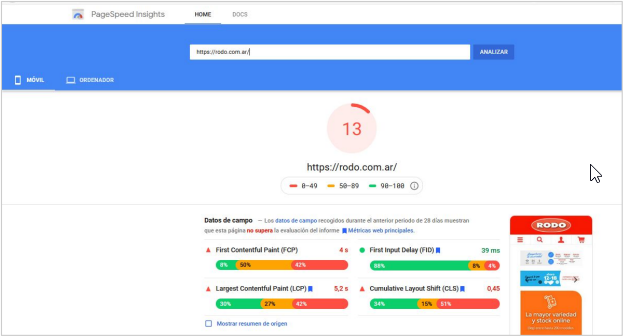
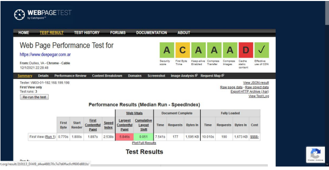
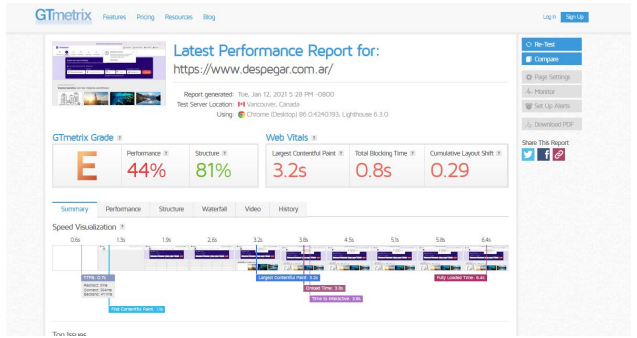

# Desafío resuelto

## Ejercicio 1

Resultado posible:  

---

## Ejercicio 2

Resultado posible:  

---

## Ejercicio 3

Resultado posible:  

---

[⬅️ Volver al índice del módulo](../modulo5_pruebas_no_funcionales.md)  
[🏠 Menú principal](../README.md)