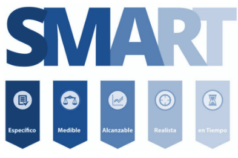
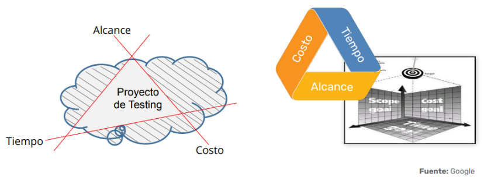
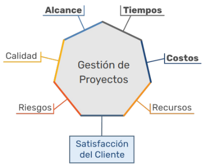
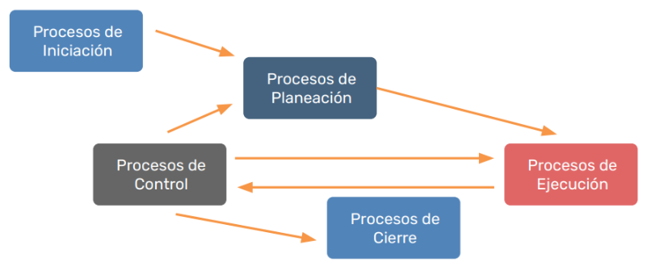
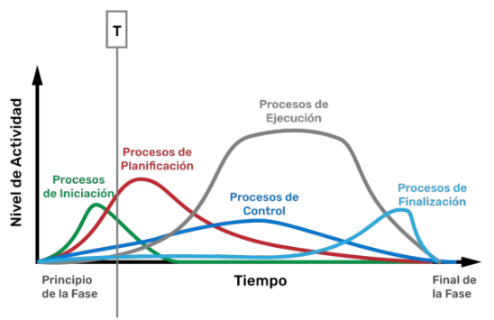
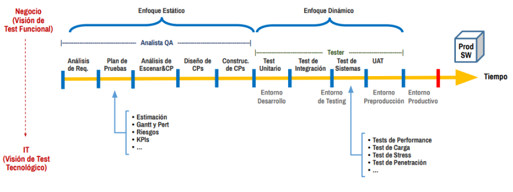
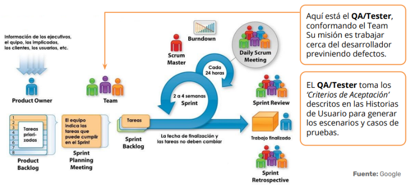

# Conceptos de Proyecto

## Contenido

- [Alcance](#alcance)
- [La triple restricción](#la-triple-restricción)
- [La triple restricción extendida](#la-triple-restricción-extendida)
- [Proyecto según PMI](#proyecto-según-pmi)
- [Ciclo de vida tradicional y Agile](#ciclo-de-vida-tradicional-y-agile)

---

## Alcance

**¿Cómo debe ser la visión del SQA Analista / Tester?**

El analista o tester debe tener una visión integral del alcance del proyecto, comprendiendo los objetivos, entregables y limitaciones. Es fundamental identificar claramente qué se va a probar, cómo y en qué plazos, para asegurar la calidad del producto final.

**¿Cómo deben ser los criterios al definir los objetivos?**

Para definir objetivos efectivos, se recomienda utilizar el modelo SMART:

- **Específicos (Specific):**
  - Los objetivos deben estar claramente definidos y expresados de manera positiva.
  - Especificar el qué, cuándo y cómo para delimitar el alcance.
- **Medibles (Measurable):**
  - Los logros deben poder cuantificarse para facilitar su seguimiento y control.
- **Alcanzables (Attainable):**
  - Los objetivos deben ser realistas y motivadores para el equipo.
  - Es importante asignar responsables para cada objetivo.
- **Realistas (Realistic):**
  - Deben ser viables considerando los recursos y el presupuesto disponible.
- **Oportunos (Time-bound):**
  - Es necesario establecer un plazo concreto para el cumplimiento de cada objetivo.

> **Tip:** Un alcance bien definido ayuda a evitar desviaciones y facilita la gestión de cambios durante el proyecto.

[⬆️ Volver al contenido](#contenido)

---

## La triple restricción

**¿Por qué un proyecto puede volverse incumplible en la realidad?**

La triple restricción se refiere a los tres factores clave que condicionan cualquier proyecto: **alcance**, **tiempo** y **costo**. Un cambio en uno de estos elementos afecta inevitablemente a los otros dos. Si no se gestionan adecuadamente, el proyecto puede volverse inviable.

> **Ejemplo:** Si se reduce el tiempo de entrega, probablemente se deba aumentar el presupuesto o reducir el alcance.

[⬆️ Volver al contenido](#contenido)

---

## La triple restricción extendida

Además de alcance, tiempo y costo, la restricción extendida incorpora otros factores como **calidad**, **recursos** y **riesgos**. Esto permite una visión más completa de los desafíos que enfrenta un proyecto.

> **Nota:** Considerar estos factores adicionales ayuda a anticipar problemas y a tomar decisiones más informadas.

[⬆️ Volver al contenido](#contenido)

---

## Proyecto según PMI

Según el PMI (Project Management Institute), un proyecto es un esfuerzo temporal que se lleva a cabo para crear un producto, servicio o resultado único. El PMI establece buenas prácticas y estándares internacionales para la gestión de proyectos.

> **Dato:** El PMI define cinco grupos de procesos: inicio, planificación, ejecución, monitoreo/control y cierre.

[⬆️ Volver al contenido](#contenido)

---

## Ciclo de vida tradicional y Agile

### Ciclo de vida de testing tradicional

En el enfoque tradicional (cascada), las fases del proyecto son secuenciales: análisis, diseño, desarrollo, pruebas y despliegue. El testing suele realizarse al final, lo que puede dificultar la detección temprana de errores.

### Ciclo de vida de testing en Agile

En metodologías ágiles, el testing es continuo e iterativo. Se integra desde el inicio y se repite en cada sprint, permitiendo una retroalimentación constante y una mayor adaptabilidad a los cambios.

> **Ventaja Agile:** La colaboración y la entrega incremental mejoran la calidad y la satisfacción del cliente.

[⬆️ Volver al contenido](#contenido)

---

**Conclusión:**  
Comprender estos conceptos es esencial para gestionar proyectos de calidad, anticipar riesgos y adaptarse a los cambios. Un enfoque estructurado y flexible permite alcanzar los objetivos y entregar valor al cliente.

---

[⬅️ Volver al índice del módulo](../modulo6_gestion_proyectos_testing.md)  
[🏠 Menú principal](../README.md)