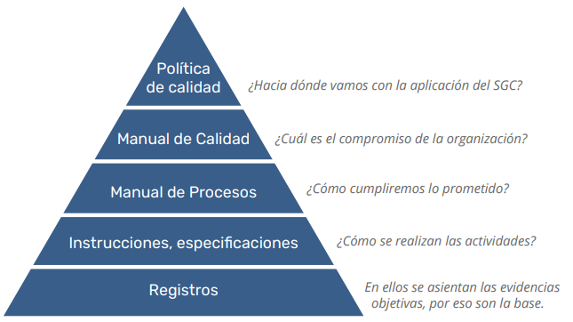
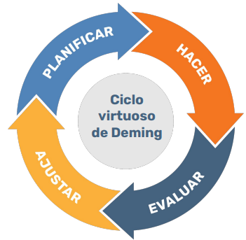

# 

## Curso QA: Testing de Software Manual

---

## 📋 Descripción

Este repositorio contiene los materiales y recursos del curso de **Testing de Software Manual (QA)**. Aquí encontrarás conceptos, prácticas, laboratorios y desafíos para formarte como tester de software.

---

## 🎯 Objetivos del Curso

- Comprender los **principios y fundamentos** del aseguramiento de la calidad.
- Aprender a **diseñar y gestionar casos de prueba**.
- Conocer los **tipos y técnicas de pruebas** funcionales y no funcionales.
- Familiarizarse con la **gestión de defectos** y la automatización básica.
- Aplicar **buenas prácticas** en proyectos de testing.

---

## 🗂️ Organización del Curso

### **Módulos del curso**

1. [**Módulo 1:** Principios y Fundamentos (Concepto de calidad)](modulo1_principios_fundamentos.md)
2. [**Módulo 2:** Diseño de Pruebas Funcionales](modulo2_Casos%20de%20prueba.md)
3. [**Módulo 3:** Gestión de Defectos](modulo3_gestion_defectos.md)
4. [**Módulo 4:** Automatización](modulo4_automatizacion.md)
5. [**Módulo 5:** Pruebas No Funcionales](modulo5_pruebas_no_funcionales.md)
6. [**Módulo 6:** Gestión de Proyectos de Testing](modulo6_gestion_proyectos_testing.md)

---

## 🌐 Recursos y enlaces útiles sobre QA

- [ISTQB Foundation Level Syllabus (PDF)](https://www.istqb.org/downloads/send/2-foundation-level-documents/3-foundation-level-syllabus-2018.html)
- [Ministerio de QA (Comunidad en español)](https://www.ministeriodeqa.com/)
- [Software Testing Help (Blog)](https://www.softwaretestinghelp.com/)
- [Ministry of Testing (Comunidad global)](https://www.ministryoftesting.com/)
- [QA Stack Exchange (Foro de preguntas y respuestas)](https://sqa.stackexchange.com/)
